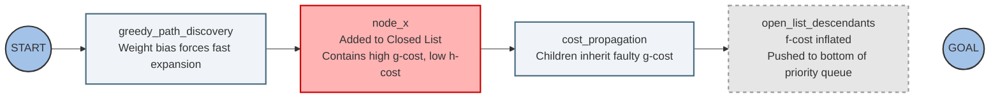
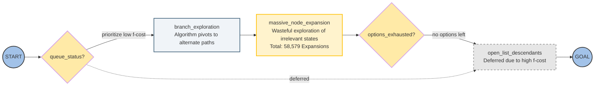
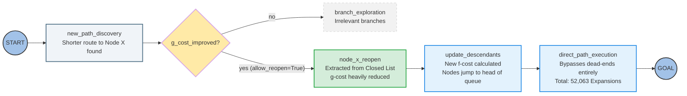

# WA\* at w=1.5 — The Reopen Cost Trap

A three-slide walkthrough of how a bounded-suboptimal WA\* search (w = 1.5) on the 15-puzzle gets trapped by an inflated g-cost, and how an `allow_reopen=True` policy rescues it.

---

## Slide 1 — The Greedy Detour

**Key points**
- Weighted heuristic drives a greedy, suboptimal dive
- Node X closes with an inflated g-cost
- Descendants starve at the bottom of the queue

**Speaker notes**

This first slide sets up the trap. Because WA\* multiplies the heuristic by w = 1.5, the search is biased toward nodes that *look* close to the goal — those with a low h-cost — even when the path to reach them is expensive. The algorithm races down a greedy path and commits Node X to the Closed List carrying a high g-cost (the actual path cost so far) but a low h-cost (the estimated distance remaining). That low h-cost is exactly why it was expanded early.

The problem is that the inflated g-cost doesn't stay local. Every child of Node X inherits it through cost propagation, so their f-cost (g plus weighted h) is inflated as well. These descendants get pushed to the bottom of the priority queue and effectively go dormant. The true, cheaper path to this region of the puzzle hasn't been found yet — so the search is poised to wander. The dashed link to the goal signals that the descendants *could* reach it, but right now they have no priority to do so.

---

## Slide 2 — Locked Out, Wandering

**Key points**
- No-reopen locks Node X permanently in Closed
- Search wastes 58,579 expansions on dead branches
- Inflated descendants reached only as a last resort

**Speaker notes**

This is the trap fully sprung, under the strict `allow_reopen = False` policy. When the priority queue is checked, the starved descendants of Node X have such high f-cost that the queue always prefers something else. So the search pivots into branch exploration — alternate regions of the state space that look cheaper but lead nowhere useful.

Because Node X is locked in the Closed List and can never be reconsidered, there's no mechanism to correct its inflated g-cost. The algorithm grinds through massive, irrelevant node expansion — 58,579 expansions in total — before its options are finally exhausted. Only then does it fall back to the deferred descendants and route through to the goal. The path is still valid and within the suboptimality bound, but the cost in work is enormous. The dotted "deferred" edge is the whole story: those children were always there, just never competitive enough to be picked until everything else was gone.

---

## Slide 3 — Reopen and Bypass

**Key points**
- Cheaper path triggers a g-cost improvement check
- Node X reopens; descendants jump the queue
- Wasteful branches bypassed — 52,063 expansions

**Speaker notes**

Now we flip to `allow_reopen = True`, and the trap dissolves. As the search proceeds it discovers a shorter route to Node X. The router asks a single decisive question: does this new path improve the g-cost of an already-closed node? If not, that branch is abandoned as irrelevant. But here the answer is yes — so the algorithm extracts Node X from the Closed List and heavily reduces its g-cost.

That correction cascades. The descendants get a freshly computed f-cost, and because their g-cost is no longer inflated, they jump to the head of the priority queue instead of languishing at the bottom. The search then executes the direct path to the goal, bypassing the dead-end branches entirely. The payoff is concrete: expansions drop from 58,579 under no-reopen to 52,063 with reopen — roughly 6,500 fewer expansions, about an 11% reduction. The lesson is that with weighted heuristics, the ability to revisit closed nodes isn't a minor optimization; it's what keeps an early greedy mistake from dominating the entire search.
